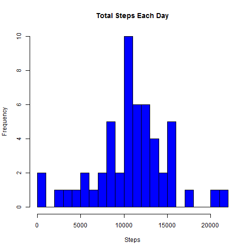
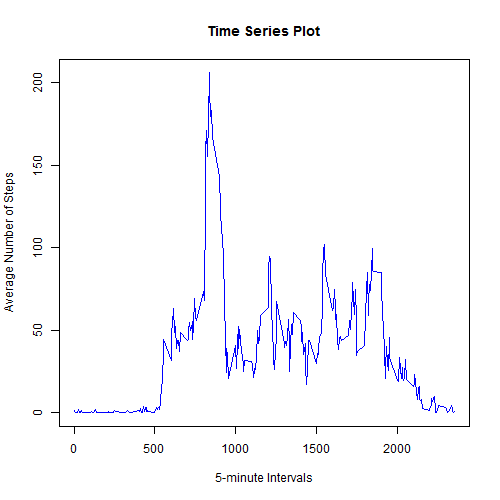
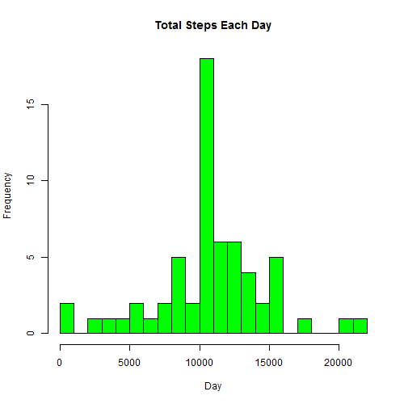
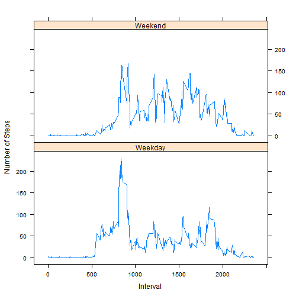

This project aims to answer a series of questions using data collected from a personal activity monitoring device. This device collects data at 5 minute intervals through out the day during the months of October and November, 2012. 

## Loading and preprocessing the data
Make all code available to read and read the data. 


```r
echo = TRUE
unzip("repdata-data-activity.zip")
act <- read.csv("activity.csv")
head(act, 5)
```

```
##   steps       date interval
## 1    NA 2012-10-01        0
## 2    NA 2012-10-01        5
## 3    NA 2012-10-01       10
## 4    NA 2012-10-01       15
## 5    NA 2012-10-01       20
```

Take a look at the type of data.


```r
class(act$steps); class(act$date); class(act$interval)
```

```
## [1] "integer"
```

```
## [1] "factor"
```

```
## [1] "integer"
```

## What is mean total number of steps taken per day?
Make a histogram of the total summation of steps taken each day. Note that do not make a barplot. The data 'act' was splitted into subsets.


```r
steps_each_day <- aggregate(steps ~ date, act, FUN = sum)
hist(steps_each_day$steps, breaks = 30, main = "Total Steps Each Day", col = "blue", xlab = "Steps")
```

 

Mean and median of the total number of steps taken per day were calculated by,

```r
mean(steps_each_day$steps); median(steps_each_day$steps)
```

```
## [1] 10766.19
```

```
## [1] 10765
```

The mean is 10766.19 and median is 10765.

## What is the average daily activity pattern?
Make a time series plot regarding the average number of steps each day.

```r
steps_each_interval <- aggregate(steps ~ interval, act, FUN = mean)
plot(steps_each_interval$interval, steps_each_interval$steps, type = "l", xlab = "5-minute Intervals", ylab = "Average Number of Steps", main = "Time Series Plot", col = "blue")
```

 

Find the 5-minute intervall, on average across all the days in the dataset, contains the maximum number of steps.

```r
steps_each_interval[which.max(steps_each_interval$steps), ]
```

```
##     interval    steps
## 104      835 206.1698
```

The maximum number steps of 206 appears at the 835th interval.

## Imputing missing values
There are some days/intervals where missing values (coded as NA) exist. The presence of missing days may introduce bias into some calculations or summaries of the data. Calculate the total number of missing values in the dataset 

```r
noNAact <- na.omit(act)
nrow(act) - nrow(noNAact)
```

```
## [1] 2304
```

2304 of missing values.

In order to create a new dataset the same dimension to the original dataset but with the missing data filled in, the mean of the 5-minute interval can be used to fill each NA value in the 'steps' column.


```r
new_act <- act
for (i in 1:nrow(new_act)) {
    if (is.na(new_act$steps[i])) {
        new_act$steps[i] <- steps_each_interval[which( new_act$interval[i] == steps_each_interval$interval ), ]$steps
    }
}
sum(is.na(new_act))
```

```
## [1] 0
```

Make a new histogram of the total number of steps taken each day.

```r
steps_each_day2 <- aggregate(steps ~ date, new_act, FUN = sum)
hist(steps_each_day2$steps, breaks = 30, main = "Total Steps Each Day", xlab = "Day", col = "green")
```

 

Calculate the mean and median total number of steps taken per day.

```r
mean(steps_each_day2$steps); median(steps_each_day2$steps)
```

```
## [1] 10766.19
```

```
## [1] 10766.19
```

With the missing data filled in, the new mean of total steps taken per day is the same as that of the old mean, while the new median of total steps taken per day is a little bit larger than that of the old one.

## Are there differences in activity patterns between weekdays and weekends?
Create a new factor variable in the dataset with two levels - "weekday" and "weekend" indicating whether a given date is a weekday or weekend day.


```r
new_act$date <- as.Date(new_act$date, "%Y-%m-%d")
day <- weekdays(new_act$date)
daypattern <- vector()
for (i in 1:nrow(new_act)) {
    if (day[i] == "Saturday" | day[i] == "Sunday")  {
        daypattern[i] <- "Weekend"
    } else {
        daypattern[i] <- "Weekday"
    }
}
new_act$daypattern <- daypattern
new_act$daypattern <- factor(new_act$daypattern)
```

Make a panel plot containing a time series plot of the 5-minute interval (x-axis) and the average number of steps taken, averaged across all weekday days or weekend days (y-axis).


```r
stepsByDay <- aggregate(steps ~ interval + daypattern, new_act, FUN = mean)
names(stepsByDay) <- c("interval", "daypattern", "steps")
library(lattice)
xyplot(steps ~ interval | daypattern, stepsByDay, type = "l", layout = c(1, 2), 
       xlab = "Interval", ylab = "Number of Steps")
```

 

Activities on the weekday has the greatest peak from all steps intervals. However, activities on weekends contributes more peaks over a hundred of steps than that of weekday. 
