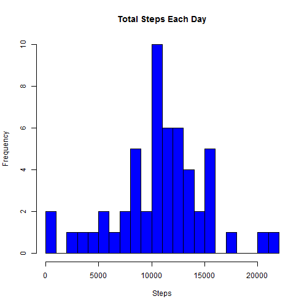

---
title: "Reproducible Research: Peer assessment 1"
author: "Wien Wong"
date: "Monday, January 19, 2015"
output: html_document
---


## Brief introduction

This project aims to answer a series of questions using data collected from a personal activity monitoring device. This device collects data at 5 minute intervals through out the day during the months of October and November, 2012. 

## Loading and preprocessing the data
Make all code available to read and read the data. 


```r
echo = TRUE
unzip("repdata-data-activity.zip")
act <- read.csv("activity.csv")
head(act)
```

```
##   steps       date interval
## 1    NA 2012-10-01        0
## 2    NA 2012-10-01        5
## 3    NA 2012-10-01       10
## 4    NA 2012-10-01       15
## 5    NA 2012-10-01       20
## 6    NA 2012-10-01       25
```

## What is mean total number of steps taken per day?
Make a histogram of the total summation of steps taken each day and calculate mean and median.


```r
steps_each_day <- aggregate(steps ~ date, act, FUN = sum)
hist(steps_each_day$steps, breaks = 20, main = "Total Steps Each Day", col = "blue", xlab = "Steps")
```

 

Mean and median are,

```r
mean(steps_each_day$steps)
```

```
## [1] 10766.19
```

```r
median(steps_each_day$steps)
```

```
## [1] 10765
```
## What is the average daily activity pattern?
Calculate average steps for each interval across all days.

```r
steps_each_interval <- aggregate(steps ~ interval, act, mean)
```

Make a time series plot regarding the average number of steps each day.

```r
plot(steps_each_interval$interval, steps_each_interval$steps, type = "l", xlab = "5-minute Interval", ylab = "Average Number of Steps", main = "Time Series Plot", col = "blue")
```

 

Find the 5-minute interval contains the maximum number of steps.

```r
steps_each_interval[which.max(steps_each_interval$steps), ]
```

```
##     interval    steps
## 104      835 206.1698
```

Calculate the total number of missing values in the dataset 

```r
noNAact <- na.omit(act)
nrow(act) - nrow(noNAact)
```

```
## [1] 2304
```
